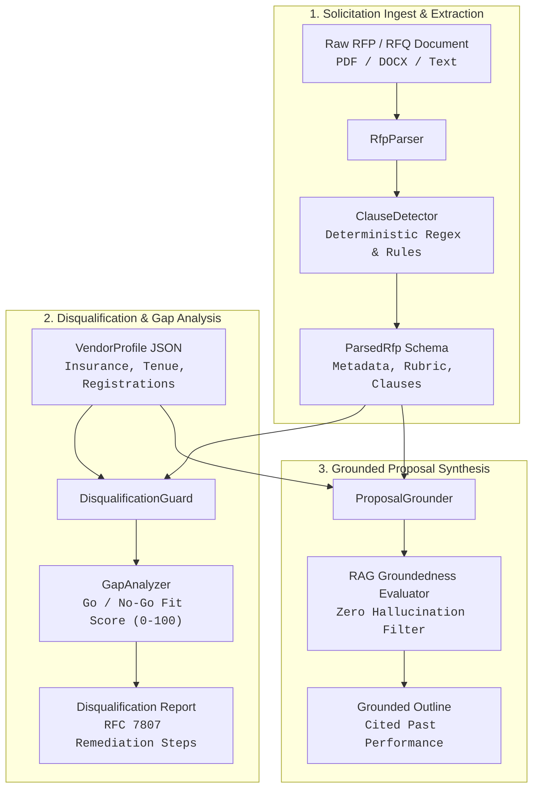

<div align="center">

# GovBid AI
### Government Contract & RFP Compliance Intelligence Platform
**Automated Disqualification Defense, Bid Qualification Scoring & Grounded Proposal Synthesis**

[](https://github.com/max-subzero/gov-bid-ai/actions)
[](https://www.python.org/downloads/)
[](https://opensource.org/licenses/Apache-2.0)
[](#)
[](#)

<p align="center">
  <em>Protecting public sector contractors from administrative disqualification and scoring higher on municipal, state, and federal procurements.</em>
</p>

---

</div>

## 📌 Executive Overview

Responding to government Requests for Proposals (RFPs), Requests for Quotations (RFQs), and Invitations for Bids (IFBs) represents a high-stakes, multi-billion-dollar enterprise endeavor. However, government procurement portals (**NYC PASSPort**, **City Record**, **SAM.gov**) publish solicitations filled with dense regulatory riders, prevailing wage schedules, bonding minimums, and strict mandatory requirements.

**Over 30% of bidder submissions are disqualified on administrative technicalities before evaluators even score their technical approach.** Generic LLMs fail in this domain because they hallucinate compliance capabilities and do not understand statutory municipal procurement rules.

**GovBid AI** is an enterprise compliance intelligence platform engineered to act as an automated **Chief Procurement Officer and Compliance Defense Auditor in a Box**. It ingests solicitation packets, performs deterministic clause extraction, executes pre-flight disqualification audits, scores bidder qualification fit, and synthesizes proposal outlines strictly grounded in verified past performance.

---

## 🏛️ System Architecture



---

## ⚡ Core Capabilities

### 1. Deterministic Clause Extraction (`ClauseDetector`)
Scans solicitation text for mandatory requirements and regulatory thresholds:
- **M/WBE Participation Goals**: Detects subcontracting quotas under NYC Local Law 1 and Federal FAR 52.219-9.
- **Prevailing Wage & Certified Payroll**: Identifies statutory trade mandates under NY State Labor Law § 220 / Davis-Bacon Act.
- **Bonding & Insurance Ceilings**: Extracts Commercial General Liability, Cyber Liability, and surety bonding limits.
- **Operating Experience Thresholds**: Extracts minimum required consecutive years of prior enterprise experience.
- **Mandatory Portal Enrollments**: Enforces active account checks for **NYC PASSPort**, **SAM.gov** (CAGE / UEI), and **VENDEX**.

### 2. Adversarial Disqualification Defense (`DisqualificationGuard`)
Audits vendor capability profiles against the extracted solicitation clauses before submission:
- Identifies insurance policy deficits and provides exact rider requirements.
- Flags missing M/WBE utilization plans or Schedule B waiver requirements.
- Alerts on missing portal enrollments with actionable remediation steps.

### 3. Quantitative Fit Scoring & Go/No-Go Decision Engine (`GapAnalyzer`)
Computes an objective qualification fit score ($0.0 - 100.0$) and delivers actionable procurement recommendations:
- **`GO`**: Score $\ge 75.0$ with zero critical disqualifiers.
- **`CONDITIONAL_GO`**: Remediable deficiencies detected (e.g. obtain insurance binder, enroll in PASSPort).
- **`NO_GO`**: Unremediable statutory disqualifiers (e.g. insufficient historical operating years).

### 4. RAG Triad Groundedness Synthesizer (`ProposalGrounder`)
Eliminates AI hallucinations by ensuring every proposal section maps directly to verified vendor past performance records:
- Scores narrative groundedness ($0.0 - 1.0$) against empirical past contract values, durations, and agency clients.
- Generates proposal outlines with verifiable citations to specific contract IDs.

---

## 🚀 Installation & Quick Start

### Installation
```bash
# Clone the repository
git clone https://github.com/max-subzero/gov-bid-ai.git
cd gov-bid-ai

# Install dependencies
pip install .
```

### CLI Commands

#### 1. Parse RFP and Extract Compliance Clauses
```bash
govbid parse tests/fixtures/sample_rfp.txt
```

#### 2. Run Pre-Flight Disqualification Audit
```bash
govbid check tests/fixtures/sample_rfp.txt tests/fixtures/sample_vendor.json
```

#### 3. Evaluate Bidder Fit & Generate Go/No-Go Score
```bash
govbid evaluate tests/fixtures/sample_rfp.txt tests/fixtures/sample_vendor.json
```

#### 4. Generate Grounded Proposal Outline with Verified Citations
```bash
govbid outline tests/fixtures/sample_rfp.txt tests/fixtures/sample_vendor.json
```

#### 5. Machine-Readable JSON Output (for CI/CD Gateways)
```bash
govbid --json evaluate tests/fixtures/sample_rfp.txt tests/fixtures/sample_vendor.json
```

---

## 🧪 Verification & Test Suite

GovBid AI includes a zero-dependency test suite running across Python 3.10, 3.11, and 3.12:

```bash
python3 -m unittest discover -s tests -v
```

All 19 test cases validate:
- Regex clause detection across prevailing wage, insurance, and M/WBE goals.
- Disqualification triggers for insurance, experience, and registration deficits.
- Fit score boundaries and Go/Conditional-Go/No-Go decisions.
- Proposal groundedness verification and citation mapping.
- End-to-end CLI execution with human-readable and JSON outputs.

---

## 📄 License

Licensed under the [Apache License, Version 2.0](LICENSE). Engineered by James Maxwell Ambenge.
